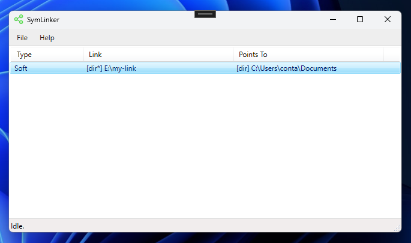

# SymLinker

A basic app written in .NET for creating & tracking symbolic links on Windows.



## About

I created this tool to make it easier to manage the various symlinks I setup for projects. "Symbolic Links" allow you to create a pointer from one place to another, and I often find these super useful when I want to avoid having more than 1 copy of the same folder on a computer.

## Things To Know 

This project requires .NET 9 to run, and is written in C#

This app needs admin privileges in-order to create symbolic links, it's unfortunately unavoidable on .NET. So when you open the solution, you maybe prompted to re-open with admin elevation.

## How To Run

Download a copy of the source code, and open/run the Symlinker.sln in Visual Studio (its free).

If you want to be fancy, open a terminal (with admin mode) and try these commands:

```bash
git clone https://github.com/kodaloid/symlinker

cd symlinker

dotnet run
```